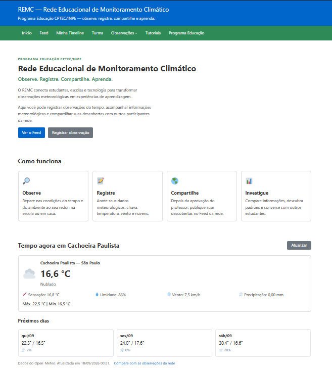
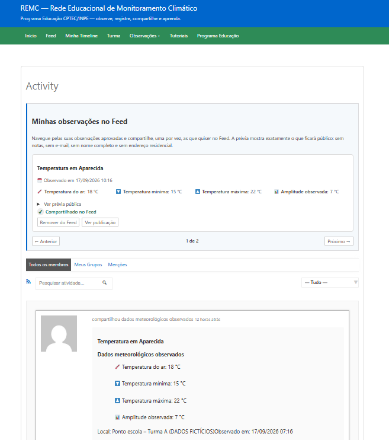
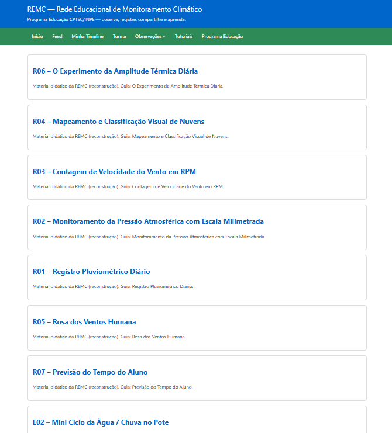
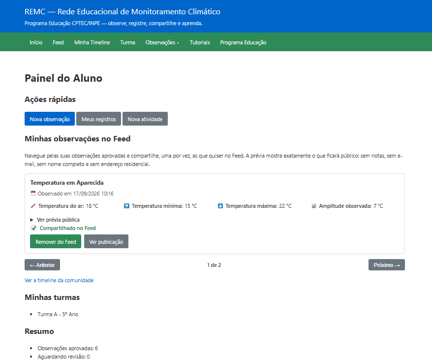
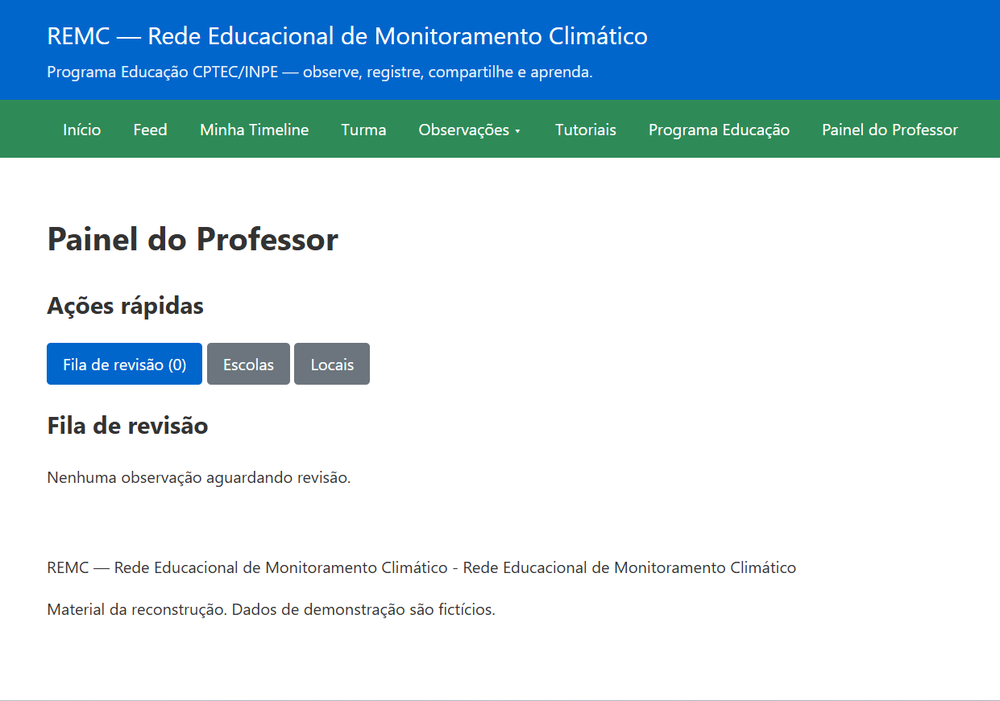

# REMC - Rede Educacional de Monitoramento Climático

Reconstrução de MVP WordPress + BuddyPress (início de 2024)

## Visão Geral

Plataforma educacional para ciência cidadã, permitindo que alunos observem e registrem condições meteorológicas (chuva, vento, temperatura, nuvens), com fluxo de revisão docente e biblioteca de 13 oficinas práticas.

Inclui um **feed social** (BuddyPress Activity) onde os alunos compartilham, por opção própria, apenas **observações aprovadas**. O que circula são dados meteorológicos; comentários e curtidas ficam restritos aos membros da turma, e visitantes apenas leem. Detalhes em `docs/arquitetura.md`.


## Como Rodar Localmente

### Opção 1: Docker Compose (Recomendado)

```bash
docker-compose up -d
```

Acesse: http://127.0.0.1

### Opção 2: PHP Built-in Server

```bash
cd wp-core
php -S 127.0.0.1:8000
```

Acesse: http://127.0.0.1:8000

### Opção 3: XAMPP/WAMP/Laragon

1. Copiar `wp-core` para `C:\xampp\htdocs\remc\`
2. Criar banco de dados: `remc_db`
3. Acessar: http://localhost/remc

## Primeira Instalação

1. Acesse http://127.0.0.1
2. Crie um usuário administrador
3. Acesse wp-admin
4. Ative o plugin "REMC Core"
5. Ative o tema "REMC Educacional"
6. (Opcional) Execute bootstrap para dados de demonstração:
   ```bash
   wp remc bootstrap
   ```

## Estrutura

```
remc/
├── wp-core/           # WordPress 6.4.3
├── wp-content/
│   ├── plugins/remc-core/    # Plugin principal
│   └── themes/remc-educacional/ # Tema
├── scripts/
└── docs/
```

## 13 Tutoriais Incluídos

**Instrumentos:** Pluviômetro PET, Anemômetro de Copos, Barômetro de Bexiga  
**Experimentos:** Nuvem na Garrafa, Mini Ciclo da Água, Experimento das Duas Vasilhas  
**Rotinas:** Pluviométrico Diário, Pressão Atmosférica, RPM do Vento, Classificação de Nuvens, Rosa dos Ventos, Amplitude Térmica, Previsão do Tempo

## Permissões

- **Administrador:** Configuração completa
- **Professor:** Turmas, revisão de observações, exportação
- **Aluno:** Observações e atividades próprias
- **Visitante:** Apenas tutoriais públicos

## Capturas de tela

Imagens de demonstração (dados fictícios, sem informação pessoal). Os arquivos
ficam em `docs/img/` — nomes e cuidados em `docs/img/LEIA-ME.md`.

<!-- Depois de adicionar as imagens em docs/img/, remova os marcadores de
comentário para exibi-las:












-->

## Documentação

- `README.md` - Este arquivo
- `INICIAR-LOCAL.md` - Instruções detalhadas
- `DESENVOLVIMENTO.md` - Comandos e configuração
- `docs/` - Documentação completa (requisitos, arquitetura, dicionário de dados, etc.)

## Dados Fictícios

O bootstrap cria: 1 escola, 2 turmas, 3 alunos, 4 observações, 13 tutoriais, 2 atividades.

## Tecnologias

- WordPress 6.4.3 (30/01/2024)
- BuddyPress 12.2.0 (23/01/2024)
- PHP 8.1.x
- MariaDB 10.6.x

## Licença

Este projeto está licenciado sob a **MIT License** — veja o arquivo [LICENSE](LICENSE).

As dependências de terceiros mantêm suas próprias licenças:
WordPress e BuddyPress são distribuídos sob a GNU General Public License (GPL),
e o Open-Meteo é usado via API pública (dados sob CC BY 4.0).
